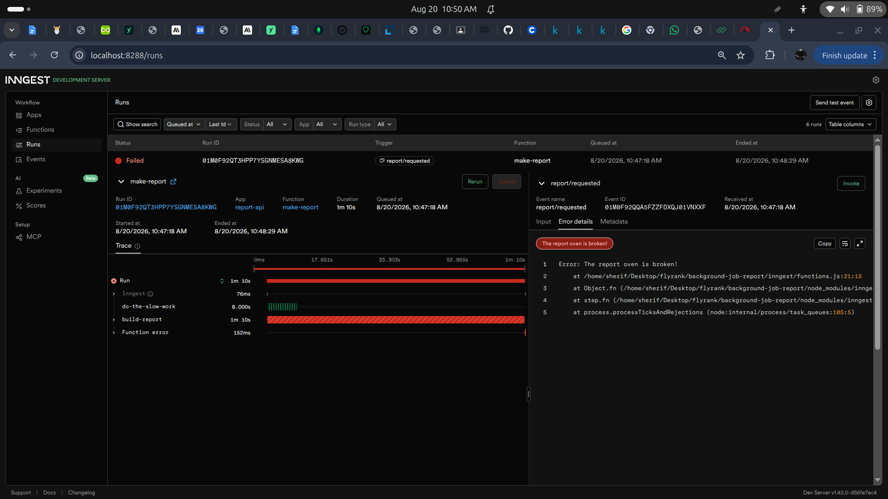
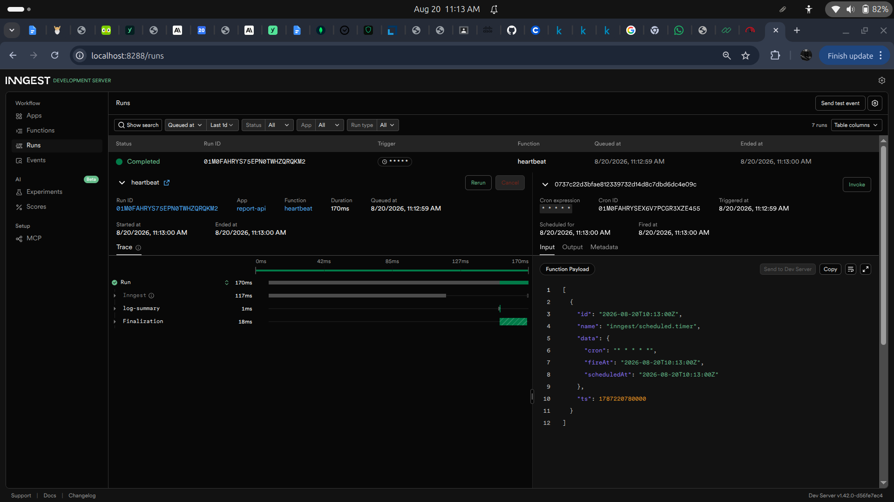

# Background Job Report API

A small API demonstrating the "accept fast, work in the background, report status" pattern using Inngest. Built for FlyRank Internship, Week 4, Assignment A7.

## What this is

`POST /reports` answers instantly (`202 Accepted`) even though building the report takes ~8 seconds. The actual work happens in a background job, and a status endpoint (`GET /reports/:id`) tells the client when it's ready — the same pattern behind every "we'll email you when it's ready" feature. A third function runs purely on a clock, with no request at all.

## How to run

Two terminals, both required:

### 1. Start the API
\`\`\`bash
npm install
INNGEST_DEV=1 node index.js
\`\`\`
Runs on `http://localhost:3000`.

### 2. Start the Inngest Dev Server
\`\`\`bash
npx inngest-cli@latest dev -u http://localhost:3000/api/inngest
\`\`\`
Dashboard at `http://localhost:8288`.

## Endpoints and functions

| Type | Name | Trigger | What it does |
|---|---|---|---|
| Endpoint | `GET /health` | HTTP | Health check |
| Endpoint | `POST /reports` | HTTP | Validates `topic`, returns `202` instantly, sends `report/requested` event |
| Endpoint | `GET /reports/:id` | HTTP | Returns report status/result, `404` if unknown |
| Function | `say-hello` | event `test/hello` | Stage 1 test function, sleeps 5s |
| Function | `make-report` | event `report/requested` | Sleeps 8s, then builds the report; throws on `topic: "fail"` to demo retries |
| Function | `heartbeat` | cron `* * * * *` | Logs pending/done/failed counts every minute |

## The 202-then-poll proof

\`\`\`bash
$ time curl -i -X POST http://localhost:3000/reports -H "Content-Type: application/json" -d '{"topic":"cats"}'
HTTP/1.1 202 Accepted
{"id":"b173a479-e516-48c4-9dbc-94933b020cbf","status":"pending"}
real    0m0.038s

$ curl -i http://localhost:3000/reports/b173a479-e516-48c4-9dbc-94933b020cbf
HTTP/1.1 200 OK
{"id":"b173a479-e516-48c4-9dbc-94933b020cbf","topic":"cats","status":"done","result":"Here is your report about cats."}
\`\`\`

## Stage 3 — retries vs. validation

Retries and validation solve different problems and shouldn't be confused. A retry is for a *wrong moment* — a network hiccup, a service that's temporarily down — where trying again is genuinely likely to succeed. Validation is for *wrong input* — a missing `topic` will never succeed no matter how many times you retry it, so it's rejected at the door with a `400` instead, and no job is ever created for it.

Sending `topic: "fail"` produces exactly this in the dashboard: 3 attempts on the `build-report` step (with increasing backoff between them), ending **Failed** — while `do-the-slow-work` (the 8-second sleep) only ran once and was never repeated, since Inngest only re-runs the step that actually failed.

## Stage 4 — cron

Cron expressions built on [crontab.guru](https://crontab.guru):
- Every day at 08:00: `0 8 * * *`
- Every Sunday at 22:00: `0 22 * * 0`

The `heartbeat` function currently runs every minute (`* * * * *`) for testing purposes, logging a line like:
\`\`\`
Heartbeat: 1 pending, 3 done, 1 failed
\`\`\`

### Failed run with retries

### Cron heartbeat runs
